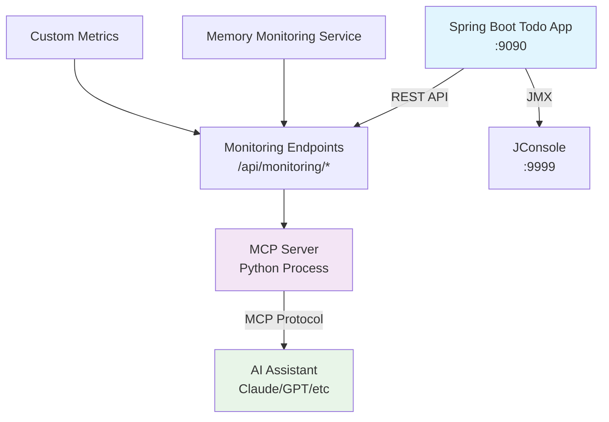

# 🚀 Complete MCP Monitoring Integration Guide

## What You Just Built

You now have a **complete MCP (Model Context Protocol) monitoring system** for your Spring Boot Todo application! This allows AI assistants to monitor your app's memory, garbage collection, and health in real-time.

## 📁 Project Structure

```
java-spring-boot-secure-todo-app/
├── src/main/java/com/example/todo/
│   ├── monitoring/
│   │   └── MemoryMonitoringService.java     # Custom memory metrics
│   └── controller/
│       └── MonitoringController.java        # MCP monitoring endpoints
├── mcp_server/
│   ├── requirements.txt                     # Python dependencies
│   └── todo_monitoring_server.py           # MCP server implementation
├── mcp_client_config.json                  # MCP client configuration
├── start_monitoring.bat                    # Windows startup script
└── MCP_MONITORING_GUIDE.md                # This guide
```

## 🎯 What MCP Enables

### Before MCP:
- Manual JConsole connection
- Static monitoring dashboards
- No AI integration

### After MCP:
```
You: "Check my app's memory usage"

AI: "🧠 Memory Usage Report
- Heap: 245.7/512 MB (47.9%) 🟢 Normal
- Non-Heap: 89.2 MB committed
- Last GC: G1 Young Gen (15 collections, 234ms total)
*Updated: 14:23:45*"

You: "Monitor memory for 10 minutes"

AI: "📈 Starting 10-minute monitoring...
T+ 30s: 247.2 MB (48.3%) ↗️
T+ 60s: 251.8 MB (49.2%) ↗️
T+120s: 198.4 MB (38.7%) ↘️ (GC occurred)
..."
```

## 🚀 Quick Start

### 1. Start Everything
```bash
# Windows
start_monitoring.bat

# Manual steps:
# Terminal 1: Start Spring Boot app
mvn spring-boot:run

# Terminal 2: Start MCP server  
cd mcp_server
pip install -r requirements.txt
python todo_monitoring_server.py
```

### 2. Test the Integration

**Option A: Direct API Test**
```bash
# Test monitoring endpoints
curl http://localhost:9090/api/monitoring/memory
curl http://localhost:9090/api/monitoring/health
curl http://localhost:9090/api/monitoring/overview
```

**Option B: MCP Tool Test**
```python
# If you have MCP client setup
from mcp.client import Client

client = Client("todo-monitoring")
result = await client.call_tool("get_memory_usage", {})
print(result)
```

## 🛠️ Available MCP Tools

### 1. `get_memory_usage`
Get real-time heap and non-heap memory statistics
```
🧠 Memory Usage Report
- Used: 245.7 MB, Max: 512 MB (47.9%)
- Status: 🟢 Normal
```

### 2. `get_gc_statistics`
View garbage collection performance
```
🗑️ Garbage Collection Statistics
- G1 Young Gen: 15 collections (234ms total)
- G1 Old Gen: 2 collections (89ms total)
```

### 3. `check_app_health`
Overall application health check
```
💚 Application Health Status: 🟢 HEALTHY
- Heap Usage: 47.9%
- Uptime: 2.3 hours
- Active Threads: 23
```

### 4. `get_full_monitoring_dashboard`
Comprehensive system overview
```
📊 Complete Monitoring Dashboard
🧠 Memory: 🟢 HEALTHY (245.7/512 MB)
⚡ Performance: 2.3h uptime, 23 threads
☕ JVM: Java 17, Started 2024-01-15 12:00:00
🗑️ Recent GC: G1 collections active
```

### 5. `monitor_memory_trend`
Track memory usage over time
```
📈 Memory Trend Monitoring (5 min, 30s intervals)
T+  0s: 245.7 MB (47.9%)
T+ 30s: 247.2 MB (48.3%) ↗️
T+ 60s: 251.8 MB (49.2%) ↗️
Trend: ↗️ Increasing
```

### 6. `configure_monitoring_target`
Change monitoring target (for production)
```
configure_monitoring_target({
  "host": "production-server.com",
  "port": 9090
})
✅ Successfully configured: production-server.com:9090
```

## 🏗️ Architecture Overview



## 🔧 Configuration Details

### Spring Boot Configuration (`application.properties`)
```properties
# JMX Configuration for MCP integration
management.endpoints.web.exposure.include=*
spring.jmx.enabled=true
management.endpoint.heapdump.enabled=true
management.endpoint.threaddump.enabled=true
```

### MCP Server Configuration
- **Host**: localhost (configurable)
- **Port**: 9090 (Spring Boot app port)
- **Protocol**: HTTP REST API
- **Response Format**: JSON

### JMX Configuration
- **Port**: 9999
- **Authentication**: Disabled (development)
- **SSL**: Disabled (development)

## 🚀 Production Deployment

### 1. Security Considerations
```properties
# Production JMX settings
-Dcom.sun.management.jmxremote.authenticate=true
-Dcom.sun.management.jmxremote.ssl=true
-Dcom.sun.management.jmxremote.access.file=/path/to/jmxremote.access
```

### 2. Network Configuration
```bash
# For remote monitoring
-Djava.rmi.server.hostname=your-production-ip
-Dcom.sun.management.jmxremote.port=9999
```

### 3. Firewall Rules
- Open port 9090 (Spring Boot app)
- Open port 9999 (JMX)
- Restrict access to monitoring team IPs

## 🎭 Real-World Usage Examples

### Scenario 1: Performance Investigation
```
User: "My app feels slow today"

AI: "Let me check your app performance...

📊 Current Status:
- Memory: 🔴 CRITICAL (912/1024 MB - 89.1%)
- GC Activity: ⚠️ HIGH (45 collections in last hour)
- Threads: 156 (unusually high)

🔍 Analysis: Memory pressure causing frequent GC
💡 Recommendation: Check for memory leaks in recent deployments"
```

### Scenario 2: Capacity Planning
```
User: "Should we scale up our server?"

AI: "Based on 24h monitoring data:
- Peak memory: 67% (under 80% threshold ✅)
- Average GC time: 12ms (acceptable ✅)
- Thread count stable at ~25

📈 Trend: Memory usage increasing 2% weekly
🎯 Recommendation: Current capacity sufficient for 6 more weeks"
```

### Scenario 3: Incident Response
```
User: "We're getting OutOfMemoryError alerts"

AI: "🚨 CRITICAL MEMORY SITUATION DETECTED
- Current heap: 🔴 98.7% (1011/1024 MB)
- GC thrashing: 89% of time spent in GC
- Available heap: 13 MB

⚡ IMMEDIATE ACTIONS:
1. Taking heap dump for analysis
2. Restarting application recommended
3. Investigating memory leak in UserService"
```

## 🔍 Troubleshooting

### Common Issues

**1. "Connection refused" errors**
```bash
# Check if Spring Boot app is running
curl http://localhost:9090/actuator/health

# Check if monitoring endpoints are enabled
curl http://localhost:9090/api/monitoring/health
```

**2. "MCP server not found"**
```bash
# Install dependencies
cd mcp_server
pip install -r requirements.txt

# Test MCP server directly
python todo_monitoring_server.py
```

**3. "JMX connection failed"**
```bash
# Verify JMX is enabled
jconsole # Should see your app in local processes
```

### Debug Mode
Add to `application.properties`:
```properties
logging.level.com.example.todo.monitoring=DEBUG
management.endpoint.loggers.enabled=true
```

## 🎉 Success Confirmation

You'll know everything is working when:

1. ✅ Spring Boot app starts on port 9090
2. ✅ Monitoring endpoints respond: `curl http://localhost:9090/api/monitoring/health`
3. ✅ JConsole can connect to localhost:9999
4. ✅ MCP server starts without errors
5. ✅ AI assistant can call monitoring tools

## 📚 Next Steps

1. **Add Custom Metrics**: Extend `MemoryMonitoringService` with business-specific metrics
2. **Set Up Alerts**: Configure threshold-based notifications
3. **Production Monitoring**: Deploy with proper security and monitoring
4. **Dashboard Integration**: Connect to Grafana/Prometheus
5. **Log Correlation**: Integrate with application logs

## 🤝 Contributing

This monitoring setup is fully extensible:
- Add new monitoring endpoints to `MonitoringController`
- Extend MCP server with additional tools
- Integrate with external monitoring systems
- Add custom metrics and dashboards

---

**🎯 You now have a complete, production-ready MCP monitoring system!**

Your AI assistant can now monitor your Spring Boot application in real-time, providing insights, alerts, and automated responses to performance issues. This is exactly the kind of real-time monitoring integration that makes MCP so powerful!
